# Central Command UI walkthrough

Every screen of the current build, captured from the running app, with
the workflow each one drives. Use it as the tester's script alongside
the checklist in [DEPLOY.md §7](../DEPLOY.md#7-test-checklist).

The data in these captures was seeded for the walkthrough. The three
clients point at example hosts, so Test Connection and the Client
Modules tab show connection errors; against a real ERP database they
list companies and modules.

*Re-captured against the Laravel/PHP backend* (see CHANGELOG.md
"Backend rewritten from Python/FastAPI to PHP/Laravel") — every screen
below was re-verified end to end through the React frontend talking to
the new backend; the JSON contract, JWT/OTP flow, and super-admin
protection all round-trip identically. This pass also carries the
frontend's visual refresh (Inter typeface, DD/MM/YYYY date formatting,
a shared color/spacing system — `frontend/src/lib/theme.ts`) and the
new Video Banner screen (previously API-only).

| Sidebar module | What it manages | Writes to client DB | Push log type |
|---|---|---|---|
| Dashboard | Counters and the last 20 push events | nothing | — |
| Clients | ERP instance registry, connection test, modules, login limit | `company_modules`, `license_settings` | `license` |
| Advertisements | Announcements + video banner, both assigned per client | `announcements`, `ad_banner_settings` | `advertisement`, `video` |
| Client Upgrades | Each client's version, upgrade / roll back through its upgrade agent | `upgrade_requests` | `version` |
| Staff | CC admin accounts; support logins pushed into client ERPs | `users`, `user_company_access` | `support_login` |

---

## Login with email OTP

`/login` · `POST /api/auth/login` → `POST /api/auth/verify-otp`

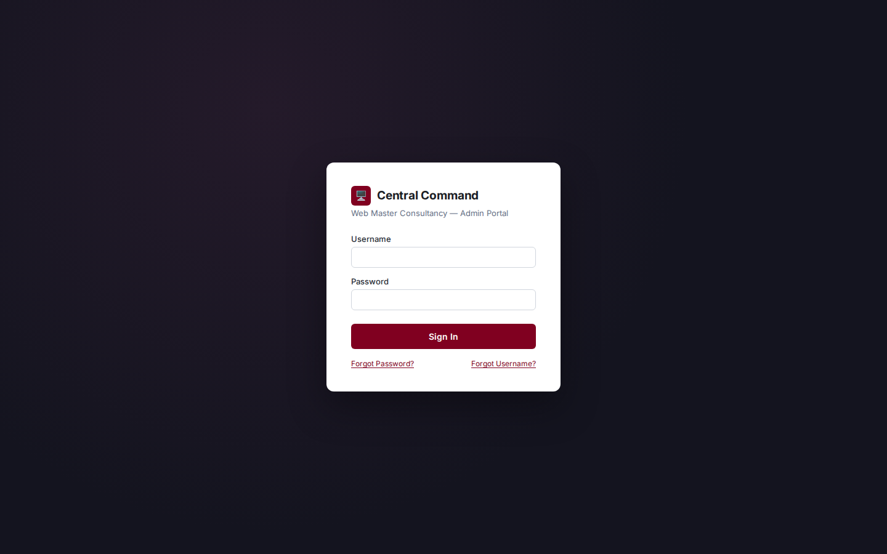
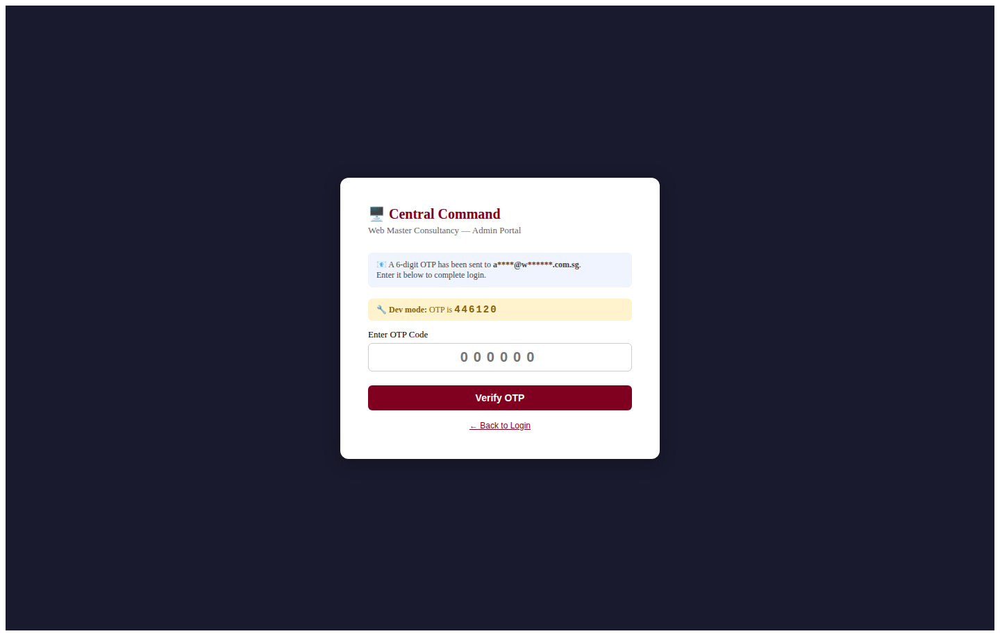

1. Enter username and password. Inactive accounts are refused before any OTP is created.
2. The API stores a `login_otps` row and would email a six-digit code valid for five minutes. Without SMTP it logs the code and returns it as `_dev_otp`, which the yellow banner shows.
3. Enter the code. A used, expired or wrong code is rejected. On success a JWT valid for eight hours is stored as `cc_token`.
4. Any later 401 clears the token and returns to `/login`.

**Forgot Password** takes a username, sends a reset OTP, then asks for the
code plus a new password (8+ characters, letters and digits). **Forgot
Username** takes an email. Both answer identically whether or not the
account exists.

## Dashboard

`/` · `GET /api/dashboard/`

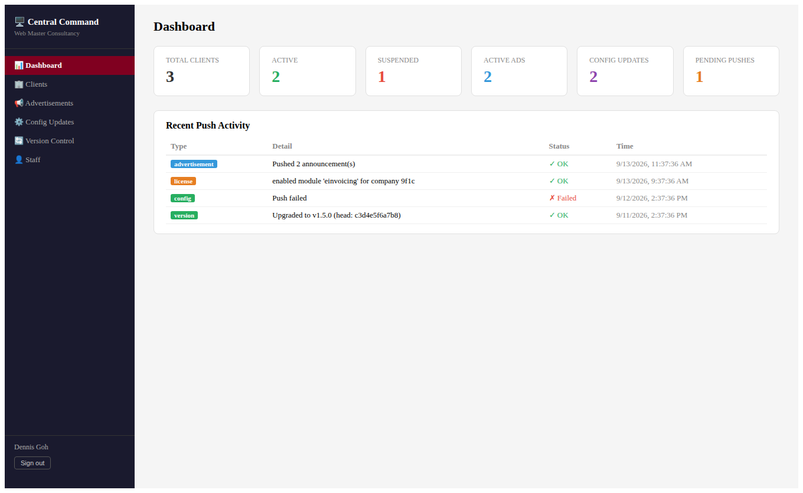

Four counters and the twenty most recent push events. Suspended
clients are excluded from every push-all.

## Clients

`/clients` · `GET, POST /api/clients/`

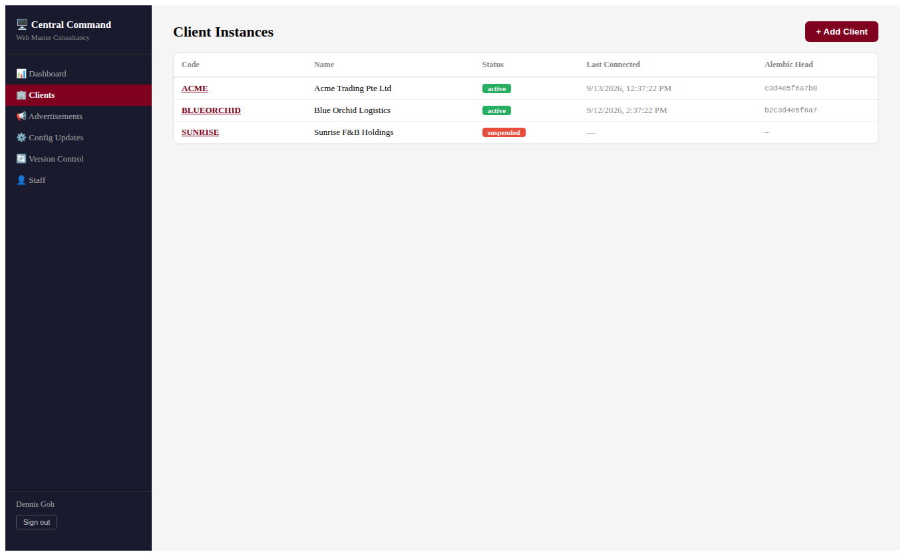
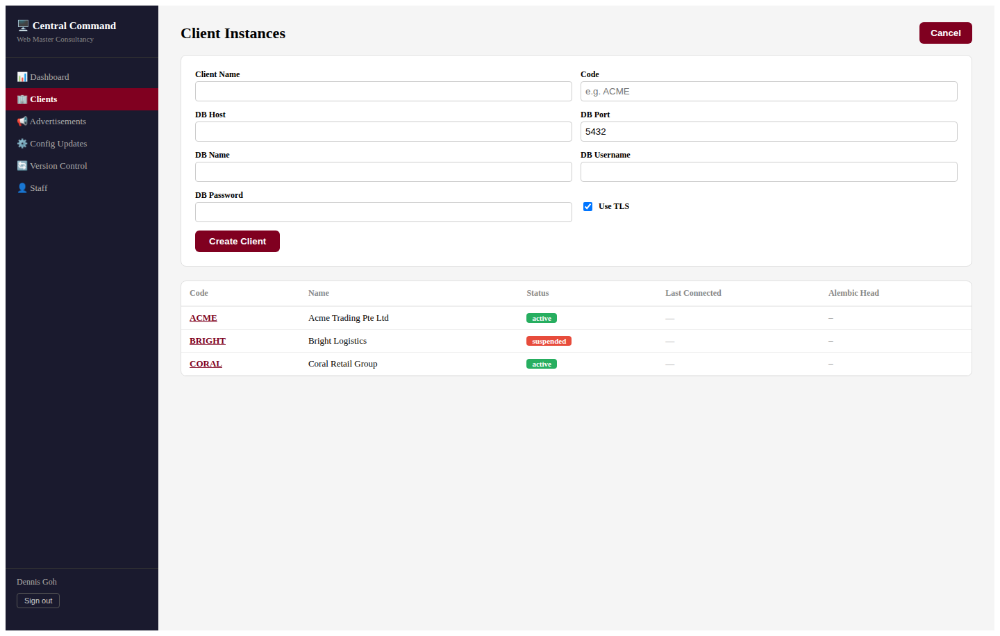

1. **+ Add Client**: code, DB host, port, database, credentials, TLS (`sslmode=require`). The password is stored in Central Command's DB and never displayed again.
2. Open the client and **Test Connection** to confirm reachability and record the Alembic head.
3. The client then appears as a target in Advertisements, Client Upgrades and Support Logins.

## Client detail: three tabs

`/clients/:id`

Header controls: **Suspend** / **Activate** toggle status; **Delete**
removes the registration after a confirm.

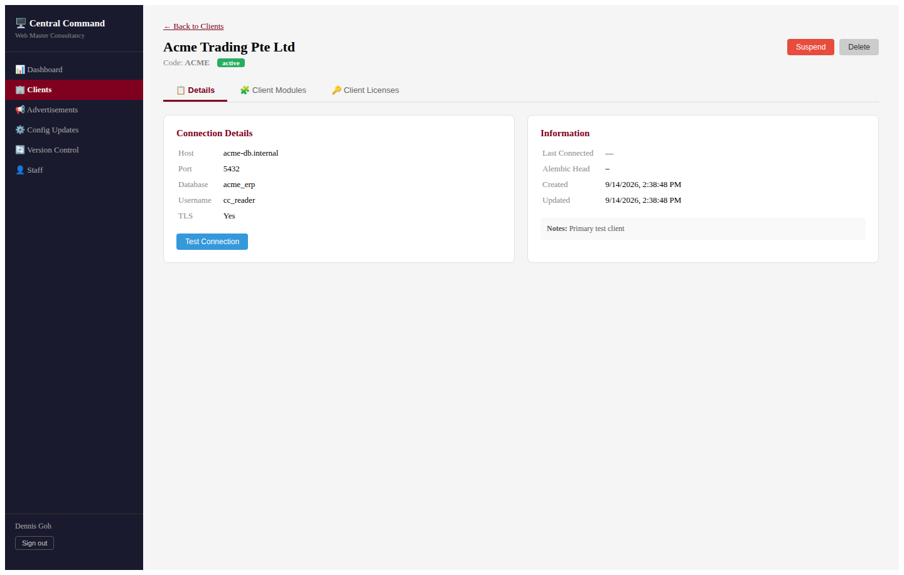
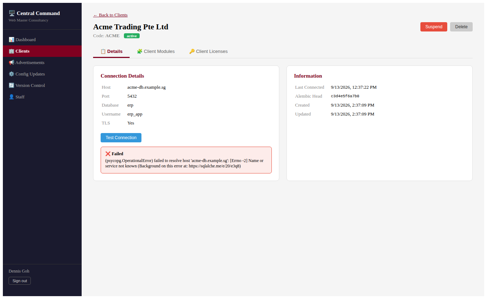

**Test Connection** reads `alembic_version` and lists up to 50 rows of
`companies`.

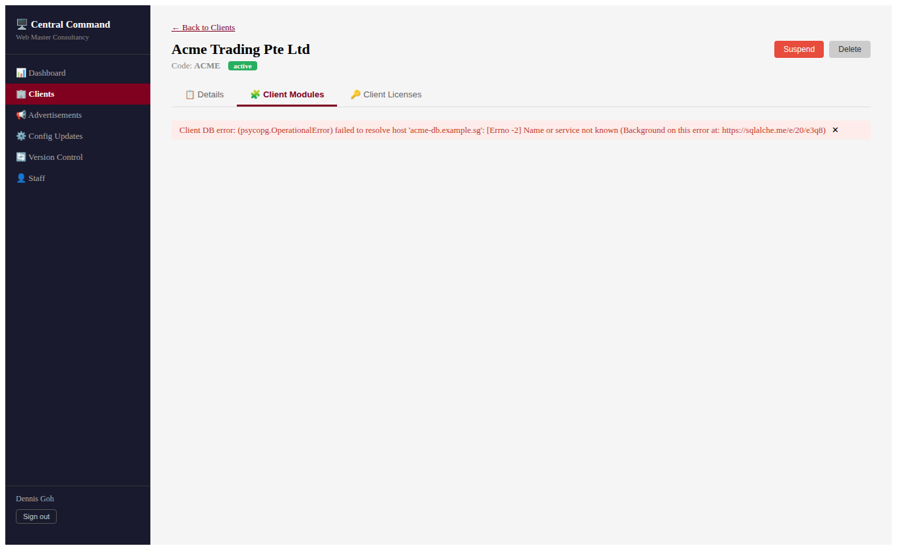
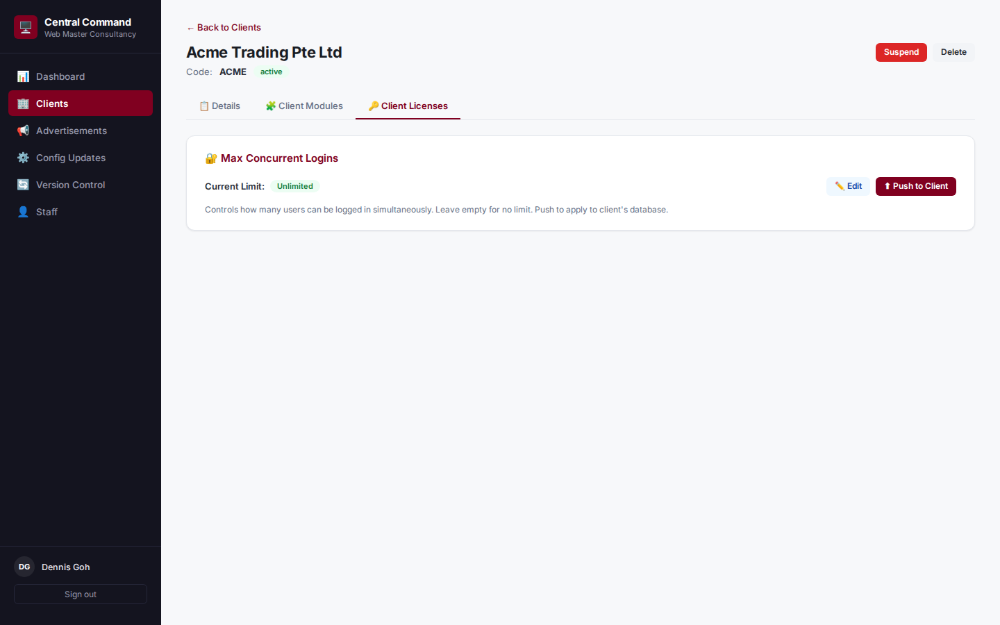

Module licensing:

1. The Client Modules tab joins the client's `modules` and `company_modules` tables, grouped by company.
2. **Enable** / **Disable** upserts `company_modules` after the Alembic check and stamps `enabled_at` on first enable.
3. Logged as `license`; the list reloads from the client.

Concurrent login limit:

1. **Edit**, enter a positive number or leave empty for unlimited, **Save**. This only updates `max_licenses` in Central Command.
2. **Push to Client** upserts `max_concurrent_logins` into the client's `license_settings`, creating the table if absent.

## Advertisements

`/advertisements` · `POST /api/advertisements/{id}/push`, `POST /api/advertisements/push-all`

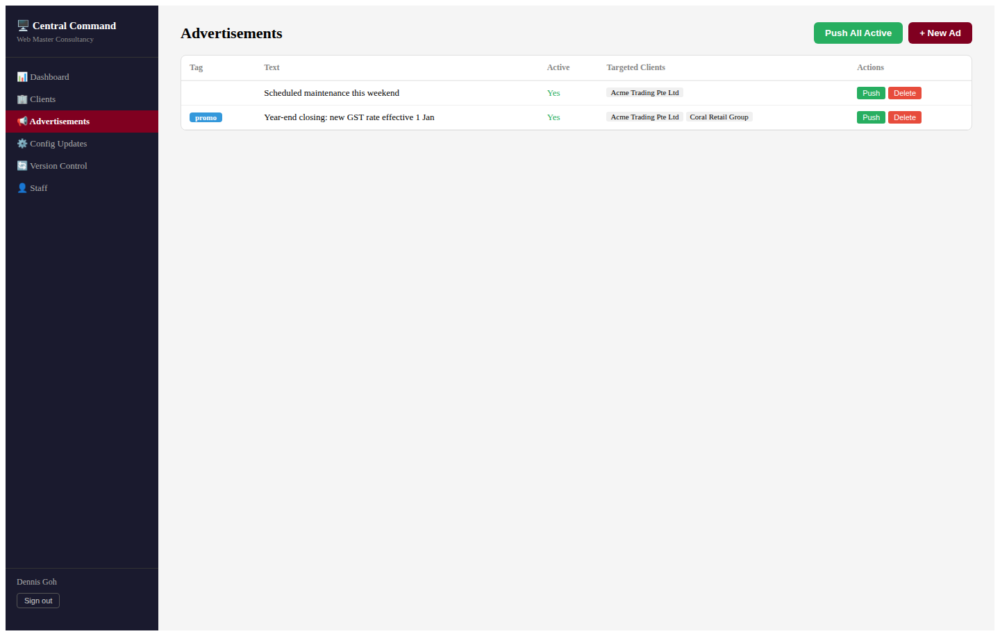
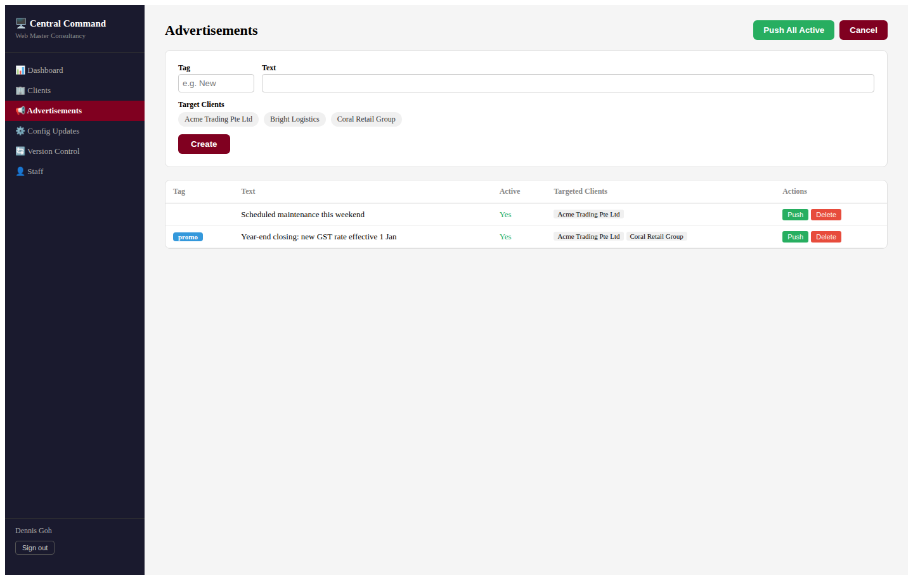

1. Create the ad with an optional tag, the text, and target clients (toggle chips).
2. **Push** upserts the announcement into each assigned client keyed on the ad UUID, so re-pushing edits in place. A green tick on the chip means pushed.
3. **Push All Active** sends every active ad to every active assigned client and reports per-client results.
4. Each client push is logged as `advertisement`, failures included.

## Video Banner

`/advertisements` (second tab) · `GET, POST /api/advertisements/videos`, `POST /api/advertisements/videos/{id}/push`

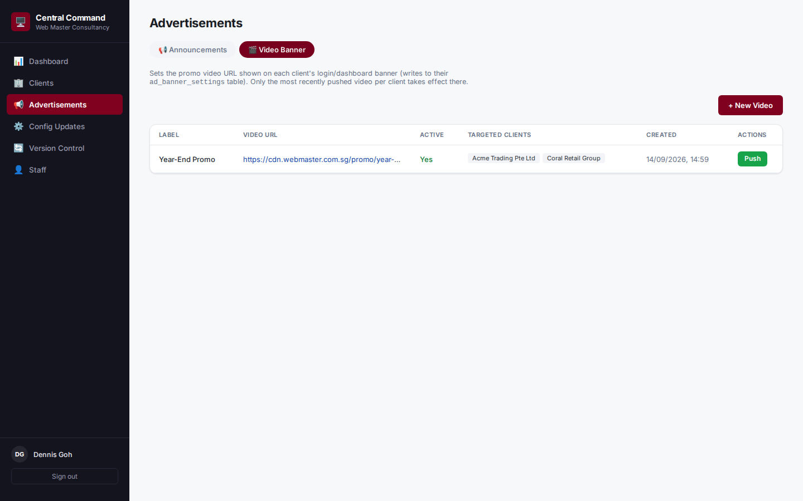
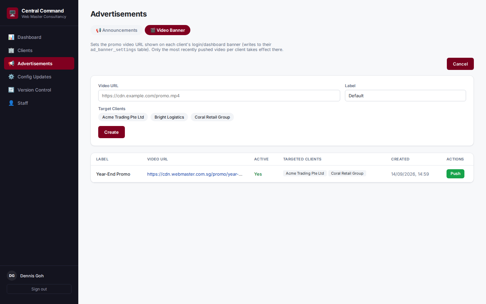

1. Create a banner with a video URL, a label, and target clients (same chip picker as Announcements).
2. **Push** writes `video_url` into the client's `ad_banner_settings` singleton row after the Alembic check. Only the most recently pushed video per client takes effect there.
3. A green tick on the client chip means that push succeeded; the API returns each video's assignments (`client_id`, `pushed_at`) so the list reflects push state without a page reload.
4. Each client push is logged as `video`.

## Client Upgrades

`/version-management` · `/api/version-management/clients`

Each client shows **Version abc1234 · DD/MM/YYYY** -- the first 7
characters of the commit it runs and that commit's date (Singapore
time), the same wording the client ERP prints on its login screen, so
the two can be tallied. **Upgrade to latest** / **Roll back** queue a
request that the upgrade agent on the client's server carries out.

## Staff and Support Logins

`/staff` · `/api/staff/`, `/api/staff/support-logins/push`, `/revoke`

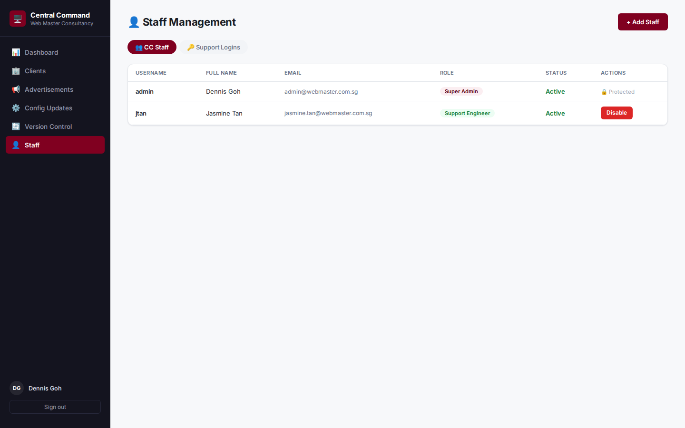
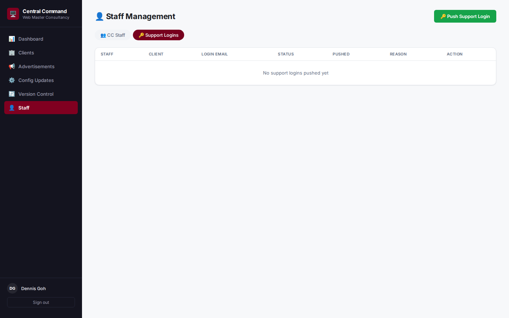

Roles: `super_admin`, `admin`, `support_engineer`, `viewer`. Only a
super_admin can add, edit, disable or delete staff, and cannot delete
themselves. Super admin accounts are protected: the API refuses to
disable, demote or delete them, and the row shows 🔒 Protected instead
of a Disable button.

Support login:

1. Choose the client and the staff member.
2. **Push Login** connects to the client DB, takes its first active company, and creates a `users` row with role `SUPPORT_ENGINEER` and `must_change_password` set (or re-enables an existing user with that email and resets the password), then grants company access.
3. Recorded in `support_logins` and logged as `support_login`.
4. **Revoke** disables the user on the client and stamps `revoked_at`.

## End-to-end: onboarding a new client

1. **Clients** – register with DB host, credentials, TLS.
2. **Client detail** – Test Connection records the Alembic head and companies.
3. **Client detail** – enable purchased modules per company; set and push the login cap.
4. **Client Upgrades** – confirm the version shown matches the client's login screen.
5. **Advertisements** – assign standing announcements (and a video banner, if any) and push.
6. **Staff** – push a support engineer login for the onboarding team.
7. **Dashboard** – every step appears in Recent Push Activity.
